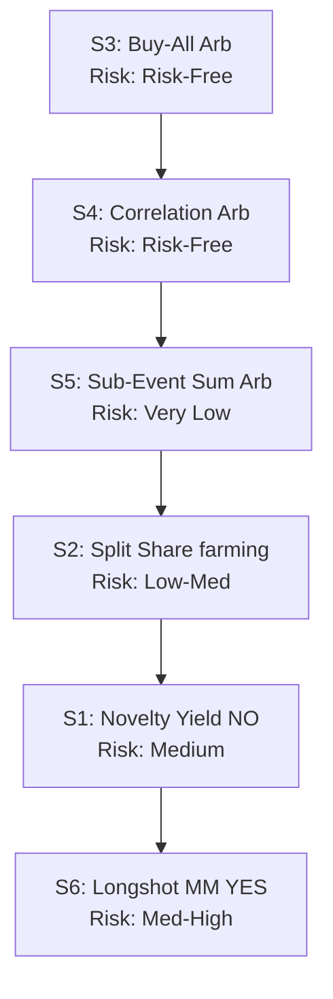

# PolyYield Engine: Handover & Architecture Document

This document serves as the complete technical context, mathematical specification, and execution blueprint for cloning the **PolyYield Engine** and hosting it in a standalone, production-ready environment. It outlines the feasibility of 24/7 autonomous trading on Polymarket, details mathematically grounded strategies (from lowest to highest risk), and defines the system's execution and database architecture.

---

## 1. Feasibility Analysis of 24/7 Live Trading on Polymarket

Polymarket is the world's largest decentralized prediction market. It runs on the Polygon blockchain (a Layer-2 scaling solution for Ethereum) and utilizes a **Central Limit Order Book (CLOB)** for trading. Hosting a live trading bot running 24/7 is **highly feasible** due to the following factors:

*   **Low Gas Fees:** Polygon transaction fees are micro-cents (typically $0.001 to $0.01 per transaction). This allows bots to trade small sizes ($0.50 to $10.00) without fees devouring profits.
*   **Zero-Fee CLOB Trading:** Polymarket's order book execution (takers and makers) currently has a 0% commission rate.
*   **Official SDK:** Polymarket provides a robust Python SDK (`py-clob-client`) that handles API authentication, order creation, and EIP-712 cryptographic signing.
*   **Off-chain Order Book, On-chain Settlement:** Orders are placed off-chain via the CLOB API (instant execution) and settled on-chain. This resolves the latency issues of pure on-chain trading.
*   **API Liquidity Rewards:** Polymarket incentivizes market makers on specific markets, paying daily rewards in tokens (USDC/POLY) which can be farmed delta-neutrally.

### Key Operational Requirements
1.  **Polygon Wallet Private Key:** A hot wallet loaded with **USDC** (collateral) and **POL** (gas).
2.  **Polymarket API Credentials:** Derived cryptographically from the wallet private key (handles API authentication).
3.  **Polygon RPC Node:** A reliable RPC provider (e.g., Alchemy, QuickNode, or public endpoints) to query balances, fetch transaction logs, and track gas costs.
4.  **24/7 Server Hosting:** A lightweight Linux instance (AWS EC2 micro, DigitalOcean Droplet, Railway, etc.) running Python with a background process manager (systemd, PM2).

---

## 2. Mathematically Grounded Strategies (Lowest to Highest Risk)

Polymarket contracts resolve to either **$1.00** (for the winning outcome) or **$0.00** (for losing outcomes). By exploiting this structural property, we can deploy strategies that range from **mathematically risk-free (100% win rate)** to statistical edges.



### Strategy 3: Buy-All Exhaustive Arbitrage (Risk-Free / Lowest Risk)
*   **Concept:** Exploits multi-outcome markets where the sum of prices of all mutually exclusive outcomes is less than $1.00.
*   **Math Proof:** Let a market have $N$ mutually exclusive and exhaustive outcomes. One outcome *must* resolve to $1.00, and all others to $0.00. Let their prices be $p_1, p_2, \dots, p_N$.
    If $\sum_{i=1}^N p_i < 1.00 - \text{Gas Fees} - \text{Slippage}$, buying all outcomes in proportion to their prices guarantees a profit.
*   **Execution Logic:**
    1. Calculate total implied probability: $P_{\text{sum}} = \sum_{i=1}^N p_i$.
    2. Given target trade capital $C_{\text{total}}$, allocate capital per leg $i$: $C_i = C_{\text{total}} \times \frac{p_i}{P_{\text{sum}}}$.
    3. Buy shares of each leg: $S_i = \frac{C_i}{p_i} = \frac{C_{\text{total}}}{P_{\text{sum}}}$. Since $S_i$ is identical for all legs, we hold exactly $S$ shares of every outcome.
    4. At resolution, exactly one leg pays $1.00. Total payout is $S \times 1.00 = \frac{C_{\text{total}}}{P_{\text{sum}}}$.
    5. Net profit: $C_{\text{total}} \times \left(\frac{1}{P_{\text{sum}}} - 1\right) - \text{Gas}$. Since $P_{\text{sum}} < 1$, profit is mathematically guaranteed.

### Strategy 4: Correlation Subset-Superset Arbitrage (Risk-Free / Lowest Risk)
*   **Concept:** Exploits probability violations between related markets. If Event $A$ is a strict subset of Event $B$ ($A \subseteq B$), then $P(A) \leq P(B)$ must hold. If $Price(A) > Price(B)$, a logical contradiction exists.
*   **Math Proof:** Let $p_A$ be the price of $A$ YES and $p_B$ be the price of $B$ YES. Suppose $p_A > p_B$. We buy $B$ YES (cost $p_B$) and $A$ NO (cost $1 - p_A$).
    *   **Case 1: $A$ occurs.** Since $A \subseteq B$, $B$ must also occur. Payout: $B$ YES pays $1.00, $A$ NO pays $0.00. Total payout = $1.00.
    *   **Case 2: $A$ does not occur, $B$ occurs.** Payout: $B$ YES pays $1.00, $A$ NO pays $1.00. Total payout = $2.00.
    *   **Case 3: $A$ does not occur, $B$ does not occur.** Payout: $B$ YES pays $0.00, $A$ NO pays $1.00. Total payout = $1.00.
    In all cases, the minimum payout is $1.00.
    *   **Total Cost:** $p_B + (1 - p_A) = 1 - (p_A - p_B)$. Since $p_A > p_B$, the cost is strictly $< 1.00$.
    *   Guaranteed profit of $(p_A - p_B)$ per contract.

### Strategy 5: Sub-Event / Sum Arbitrage (Very Low Risk)
*   **Concept:** A parent market (e.g., "Will X happen in 2026?") must equal the sum of its mutually exclusive sub-event markets (e.g. "Will X happen in Q1?", "Q2?", "Q3?", "Q4?").
*   **Math Proof:** Let $P_{\text{parent}}$ be the parent YES price, and $\sum P_{\text{sub}}$ be the sum of sub-events YES prices.
    *   If $P_{\text{parent}} > \sum P_{\text{sub}}$, we buy Parent NO (cost $1 - P_{\text{parent}}$) and the basket of all Sub-event YES tokens (cost $\sum P_{\text{sub}}$).
        *   If the event happens: One sub-event YES pays $1.00, Parent NO pays $0.00. Payout = $1.00.
        *   If the event does not happen: All sub-events YES pay $0.00, Parent NO pays $1.00. Payout = $1.00.
        *   Total Cost: $(1 - P_{\text{parent}}) + \sum P_{\text{sub}} = 1 - (P_{\text{parent}} - \sum P_{\text{sub}})$. Since $P_{\text{parent}} > \sum P_{\text{sub}}$, the cost is $< 1.00$ for a guaranteed $1.00$ payout.
    *   If $P_{\text{parent}} < \sum P_{\text{sub}}$, we buy Parent YES (cost $P_{\text{parent}}$). Hedging the sub-events requires shorting the basket, which on Polymarket requires buying the sub-event NO basket (not delta-neutral unless sized complexly). Thus, if we cannot short easily, this becomes a directional value trade (buying Parent YES because it is underpriced relative to the sum of sub-events) rather than a risk-free arbitrage.

### Strategy 2: Split Share Delta-Neutral Liquidity Farming (Low to Medium Risk)
*   **Concept:** Provide liquidity to both sides of the order book (YES and NO limit orders) on high-reward markets to harvest daily Polymarket liquidity rewards, while remaining delta-neutral.
*   **Math Principle:** Placement of tight limit orders just below the mid-spread (YES @ $Mid - 0.01$ and NO @ $(1-Mid) - 0.01$) minimizes distance from mid and maximizes the liquidity reward score. Since YES and NO positions cancel each other out, directional risk is zero.
*   **Risks:** Inventory imbalance (adverse selection) where one leg is filled but the market moves before the other leg is filled.

### Strategy 1: Novelty Yield (Medium Risk)
*   **Concept:** Buying NO on low-probability meme/culture/entertainment contracts (e.g., YES price $< 7\%$) that exhibit a longshot bias.
*   **Math Principle:** Low-probability event contracts systematically overprice the YES outcome due to speculative retail interest. By buying NO at $> 93\%$, we capture a reliable premium that resolves to $1.00 upon expiry.
*   **Risks:** Tail-risk (the meme actually happens). Requires high diversification across unrelated markets, small position sizes, and strict calibration.

### Strategy 6: Longshot Bias Market Maker (Medium to High Risk)
*   **Concept:** Systematically sell YES (buy NO) on highly overpriced longshots using a historical calibration model.
*   **Math Principle:** Use a historical calibrator to map implied probability (market price) to actual historical resolution rate. If $P_{\text{implied}} > P_{\text{true}}$, the expected value (EV) is positive:
    $$EV = \text{Shares} \times \left[ (P_{\text{implied}} - \text{Gas}) \times (1 - P_{\text{true}}) - (1 - P_{\text{implied}} + \text{Gas}) \times P_{\text{true}} \right]$$
*   **Risks:** Drawdown variance. Requires a large portfolio of independent markets for the law of large numbers to materialize the edge.

---

## 3. System Architecture & Component Design

The cloned standalone codebase should follow a lightweight, modular, and fast asynchronous architecture:

```
polyyield-bot/
│
├── config.py              # Configuration loader (env vars, hot keys)
├── main.py                # Bot orchestrator & FastAPI server entry
├── requirements.txt       # Dependencies
│
├── db/
│   ├── database.py        # SQLite / DuckDB setup and migrations
│   └── config.py          # Dynamic configuration parameters table
│
├── services/
│   ├── gas_tracker.py     # Polygon gas cost calculator
│   ├── keystore.py        # Encrypted storage for private keys
│   └── alerts.py          # Telegram / Discord webhook alert dispatcher
│
└── strategies/
    ├── engine.py          # Opportunity scanning loop (S1 - S6)
    ├── settlement.py      # Background worker resolving closed trades
    ├── calibration.py     # Longshot calibrator rebuilding correction factors
    └── registry.py        # Metadata registry of strategies
```

### Database Schema (SQLite)

```sql
-- Opportunities found during scanning
CREATE TABLE poly_yield_opportunities (
    id TEXT PRIMARY KEY,
    strategy TEXT NOT NULL,
    risk_level TEXT,
    execution_type TEXT,
    market_type TEXT,
    reward_score REAL,
    slippage_bps REAL,
    market_id TEXT NOT NULL,
    market_title TEXT,
    market_url TEXT,
    outcome TEXT,
    entry_price REAL,
    implied_prob REAL,
    yes_price REAL,
    no_price REAL,
    annualized_apy REAL,
    profit_pct REAL,
    days_to_expiry REAL,
    action TEXT,
    exec_mode TEXT,
    suggested_usdc REAL,
    status TEXT DEFAULT 'open',
    notes TEXT,
    instructions TEXT, -- JSON array of manual steps
    legs TEXT,         -- JSON array of legs (for multi-outcome)
    updated_at TIMESTAMP DEFAULT CURRENT_TIMESTAMP
);

-- Active and historical positions
CREATE TABLE poly_yield_positions (
    id TEXT PRIMARY KEY,
    opportunity_id TEXT,
    strategy TEXT NOT NULL,
    market_id TEXT NOT NULL,
    market_title TEXT,
    outcome TEXT NOT NULL,
    shares REAL NOT NULL,
    entry_price REAL NOT NULL,
    cost_usdc REAL NOT NULL,
    order_id TEXT,
    status TEXT DEFAULT 'open', -- open, won, lost, settled
    entry_at TIMESTAMP DEFAULT CURRENT_TIMESTAMP,
    settled_at TIMESTAMP,
    realized_pnl REAL,
    predicted_apy REAL,
    predicted_profit_pct REAL,
    predicted_days_to_expiry REAL,
    actual_fill_price REAL,
    actual_gas_usdc REAL,
    risk_level TEXT,
    fill_slippage_bps REAL,
    quality_at_entry REAL,
    predicted_pnl_usdc REAL,
    mode TEXT,                  -- paper, live
    settlement_outcome TEXT,
    apy_delta REAL
);

-- Strategy performance stats
CREATE TABLE poly_yield_stats (
    strategy TEXT PRIMARY KEY,
    total_pnl REAL DEFAULT 0.0,
    total_returned REAL DEFAULT 0.0,
    win_count INTEGER DEFAULT 0,
    loss_count INTEGER DEFAULT 0,
    open_positions INTEGER DEFAULT 0,
    last_scan_at TIMESTAMP,
    updated_at TIMESTAMP DEFAULT CURRENT_TIMESTAMP
);
```

---

## 4. Execution Guards & Safety Rules

For a live bot, execution safety is critical. The following rules must be coded into the execution service:

1.  **Pre-Flight Liquidity Check (VWAP Walk):**
    Before executing a trade (especially multi-leg trades like S3, S4, S5), query the L2 order book asks/bids using the CLOB client. Walk the depth to verify that the size of our order can be filled within a max slippage threshold (default 1.5%).
2.  **Leg Pre-Flight Check:**
    For multi-leg arbitrages, do not place *any* orders if *any* single leg fails the slippage check or has insufficient book depth.
3.  **Parallel Execution:**
    Execute multi-leg trades simultaneously using `asyncio.gather`.
4.  **Partial Fill Unwind & Killswitch:**
    If one leg fails to place (due to network error or sudden price change) while other legs have filled, immediately attempt to cancel the remaining open orders. If they cannot be cancelled, trigger a **Killswitch** to freeze the bot, stop all auto-executions, and fire a critical alert to the operator (Telegram/Discord) for manual intervention.
5.  **USDC Drawdown Cap:**
    Verify if the current capital exposure exceeds a safety drawdown limit (e.g., max 50% of wallet balance). Block auto-execution if exceeded.
6.  **Gas Fee Threshold:**
    Estimate Polygon gas cost before execution. If the expected profit is less than the gas cost plus a buffer, skip the opportunity.

---

## 5. Hosting & Deployment Guidelines

To host this separately for 24/7 profitable operation:

1.  **Server Selection:**
    *   A cheap VPS such as **DigitalOcean (Basic Droplet - $6/month)** or **AWS EC2 (t3.micro - Free Tier / ~$8/month)**.
    *   Operating System: Ubuntu 22.04 LTS.
2.  **Process Manager:**
    *   Use **systemd** or **PM2** to run the bot. PM2 is highly recommended for python scripts:
        ```bash
        pm2 start main.py --name "polyyield-bot" --interpreter python3
        ```
    *   Configure PM2 to restart on crash and start on boot: `pm2 startup` and `pm2 save`.
3.  **Monitoring & Telemetry:**
    *   Configure Discord or Telegram webhooks in `services/alerts.py`.
    *   The bot should send notifications for:
        *   ✅ Boot & Shutdown events.
        *   💰 Execution of new trades (USDC amount, expected yield, legs).
        *   🏁 Settlement of positions (Win/Loss, realized PnL, realized APY).
        *   🚨 Warnings (wallet balance low, RPC node failure).
        *   🔥 Critical Failures (partial fill, killswitch activation).
4.  **Paper Mode First:**
    *   Always run the bot in `paper` mode (`poly_yield.active_mode = paper`) for at least **10 resolved trades** to verify that the scanning logic, order book checks, and settlement loops match reality before risking real capital.

---

## 6. Original Reference Implementations
The core logic in this document is adapted from the production-proven systems:
*   Scanner & Strategies Loop: [poly_yield_engine.py](file:///d:/Shi/Poly/Betdaq/backend/domains/finance/strategies/poly_yield_engine.py)
*   Settlement & Resolution Worker: [poly_yield_settlement.py](file:///d:/Shi/Poly/Betdaq/backend/domains/finance/strategies/poly_yield_settlement.py)
*   Longshot Correction Calibration: [longshot_calibration.py](file:///d:/Shi/Poly/Betdaq/backend/domains/finance/strategies/longshot_calibration.py)
